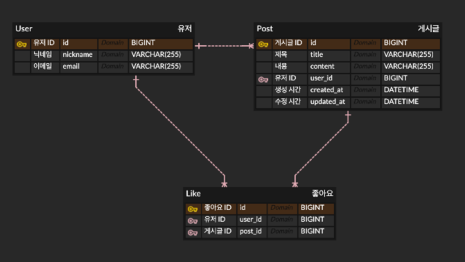

# ERD란 무엇인가요?
## ERD(Entity Relationship Diagram)
ERD란 데이터베이스의 구조를 시각적으로 표현한 설계도로,
엔티티(Entity), 속성(Attribute), 그리고 엔티티 간의 관계(Replationship)를 그림으로 나타낸 것입니다.
즉, 어떤 데이터를 어떻게 저장하고, 테이블 간에는 어떤 관계가 있는지를 한눈에 파악할 수 있도록 도와주는 도구입니다.

## ERD의 구성 요소
1. Entity(엔티티)
데이터를 저장하는 객체로, 실제 데이터베이스에서는 테이블을 의미합니다.
- ex)
  - User, Post

2. Attribute(속성)
엔티티가 가지는 데이터의 성질로, 테이블의 컬럼에 해당합니다.
- ex)
  - User: id, email, nickname
  - Post: id, title, content

3. Relationship(관계)
엔티티 간의 연결 관계를 의미합니다.
- ex)
  - User : Post = 1 : N -> 한 명의 사용자는 여러 개의 게시글을 작성할 수 있음

## ERD의 필요성
- 데이터베이스 구조를 명확하게 설계할 수 있음
- 테이블 간 관계를 쉽게 이해할 수 있음
- 협업 시 데이터 구조를 공유하기 쉬움
- API 설계 개발 방향을 잡는 기준이 됨


# 구현한 내용에 대해 ERD 구조도를 ERD Cloud에 그려서 올려주세요.


# QueryDSL이란 무엇이고, JPQL과 어떤 차이가 있나요?
## QueryDSL
QueryDSL은 데이터베이스 쿼리를 문자열이 아닌 자바 코드로 작성할 수 있도록 도와주는 라이브러리입니다.
타입 안정성을 제공하여 컴파일 시점에 오류를 잡을 수 있는 것이 가장 큰 특징입니다.

## JPQL이란?
JPQL(Java Persistence Query Language)은 엔티티 객체를 대상으로 SQL과 유사하게 작성하는 문자열 기반의 쿼리 언어입니다.
```
@Query("SELECT p FROM Post p WHERE p.title = :title")
List<Post> findByTitle(String title);
```

## JPQL의 문제점
- 문자열 기반이라 오타를 컴파일 단계에서 잡을 수 없음
- 런타임 시점에 오류 발생
- IDE 자동완성 지원이 부족함
- 동적 쿼리 작성이 어려움

## QueryDSL의 특징
```
Qpost post = Qpost.post;

queryFactory
    .selectFrom(post)
    .where(post.title.eq("제목"))
    .fetch();
```
- 자바 코드로 쿼리 작성 가능
- 컴파일 시점에서 오류 검출 가능
- IDE 자동완성 지원
- 동적 쿼리 작성이 용이함